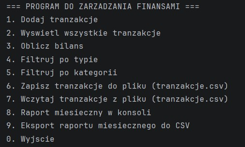
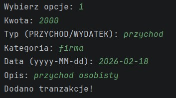
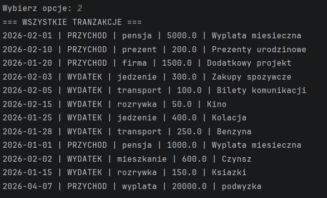
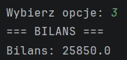
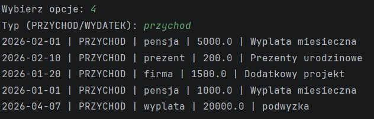
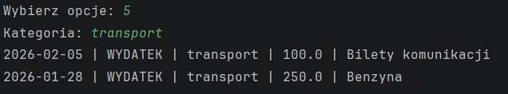
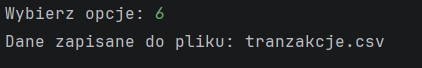
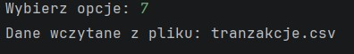
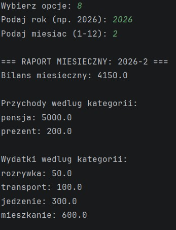
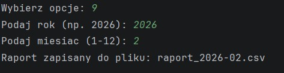

# Projekt: Program do zarządzania finansami

## Autor
Hania Małek

## Opis
Prosty program do zarządzania osobistymi finansami w formie konsolowej aplikacji w Javie. 

Pozwala na dodawanie tranzakcji, przeglądanie bilansu, filtrowanie oraz generowanie raportów miesięcznych.

## Funkcjonalności

Aplikacja działa w trybie konsolowym i udostępnia następujące opcje:

### 1. Dodaj tranzakcje
Umożliwia dodanie nowej tranzakcji.
Użytkownik podaje:
- kwote
- typ (PRZYCHOD lub WYDATEK)
- kategorie
- date (format: RRRR-MM-DD)
- opis

  
---

### 2. Wyswietl wszystkie tranzakcje
Wyświetla wszystkie tranzakcje zapisane aktualnie w pamięci programu.

---

### 3. Oblicz bilans
Oblicza całkowity bilans finansowy:

  

---

### 4. Filtruj po typie
Wyświetla tranzakcje wybranego typu:
- PRZYCHOD
- WYDATEK

  
---

### 5. Filtruj po kategorii
Wyświetla wszystkie tranzakcje należące do podanej kategorii podanej przez użytkownika.

---

### 6. Zapisz tranzakcje do pliku (tranzakcje.csv)
Zapisuje wszystkie aktualne tranzakcje do pliku `tranzakcje.csv` w katalogu głównym projektu. Plik jest nadpisywany.

---

### 7. Wczytaj tranzakcje z pliku (tranzakcje.csv)
Wczytuje dane z pliku `tranzakcje.csv`.

Lista w pamięci programu jest czyszczona przed wczytaniem, dzięki czemu nie powstają duplikaty.

---

### 8. Raport miesieczny w konsoli
Generuje raport dla wybranego miesiąca i roku:
- bilans miesięczny
- suma przychodów według kategorii
- suma wydatków według kategorii

Raport wyświetlany jest w konsoli.

---

### 9. Eksport raportu miesiecznego do CSV
Tworzy plik: `raport_RRRR-MM.csv`

Zawiera:
- bilans miesięczny
- przychody według kategorii
- wydatki według kategorii

Plik zapisywany jest w katalogu głównym projektu.

---

### 0. Wyjscie
Zamyka aplikację.
